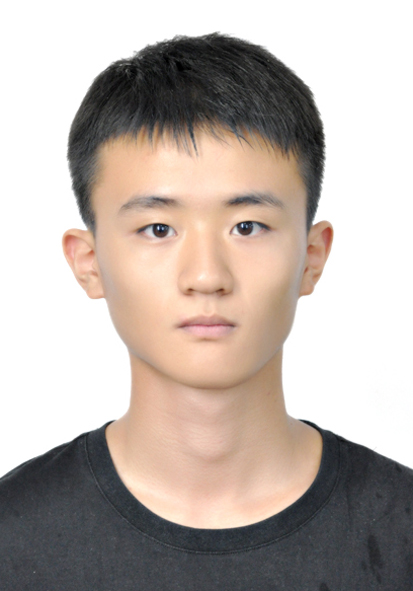
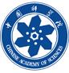
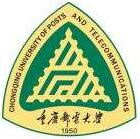

王鑫硕(Noah)</>

Postgraduat Student of Signal and Information Processing

E-mail: wangxinshuo0421@gamil.com; wangxinshuo0421@foxmail.com

GitHub: wangxinshuo0421

Updata 10/25/2020

## Education experience

* 2021/09 - Now M.S. at Nation Network New Media Engineering Research Center of Signal and Information Processing, [University of Chinese Academy of Sciences (UCAS)][MS School]

* 2017/09 - 2021/06 B.S. at School of Communication and Information Engineering of Communication Engineering, [Chongqing University of Posts and Telecommunication (CQUPT)][BS School]

*  2014/09 - 2017/06 High school student in [Shandong Experimental High School][High School]

[MS School]: https://www.ucas.ac.cn/
[BS School]: https://www.cqupt.edu.cn/
[High School]: http://sdshiyan.jinan.cn/

## Publications

* **Xinshuo Wang**, Keyao Li, Yi Zheng, Peng Jia:  A distributed ad hoc network intelligent garbage can clearing system and a method. **Chinese Patent for Invention** (Accepted, Published, Under the Substantive Examination Stage) 07/2020

* **Xinshuo Wang**, Sikun Lu, Qianru Liu, Zhen Luo: A personal safety protection system for motor vehicle passengers. **Chinese Patent for Invention** (Accepted, Published, Under the Substantive Examination Stage) 06/2020

## Awards

* **2019/05 - Third Prize - The 12th Central China Regional Mathematical Modeling Invitational Competition **
* **2019/08 - National Second Prize - National Undergraduate Electronics Design Contest**
* **2019/10 - Third Prize in Western Division - The 4th Smart Connected Innovation Competition**
* **2019/11 - National Third Prize - National University Computer Energy Challenge**
* **2020/07 - Chongqing Division Second Prize - The 11th Lanqiao Cup National Software and Information Technology Professional Competition Program Design Group**

